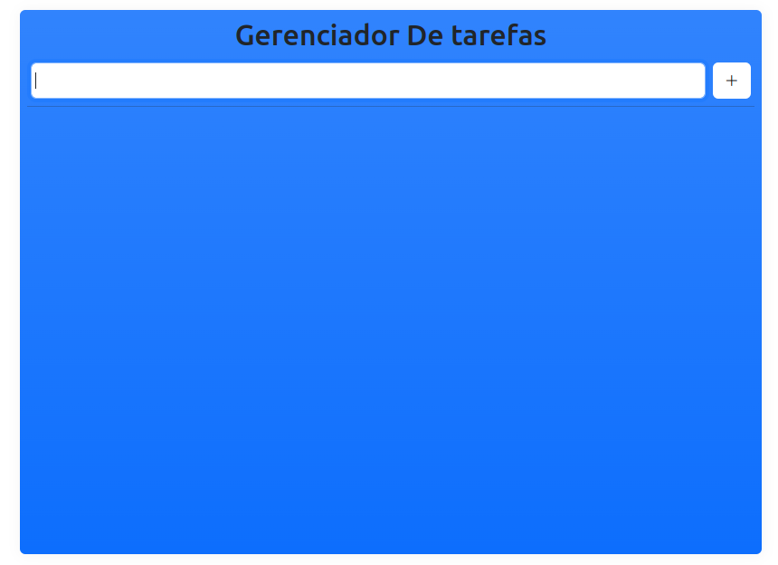

<h1> WebApp: Gerenciador de tarefas com Flask </h1>

### Sobre 
* WebApp simples que permite adcionar tarefas, marcar como concluida e remover tarefas adcionadas.

### Como posso acessar?
* Através do link <a href="https://gerenciador-de-tarefas.onrender.com/"> Gerenciador de tarefas </a>

<figure style="text-align: center;">
     </img>
    <caption s> Captura de tela do app </caption>
</figure>

